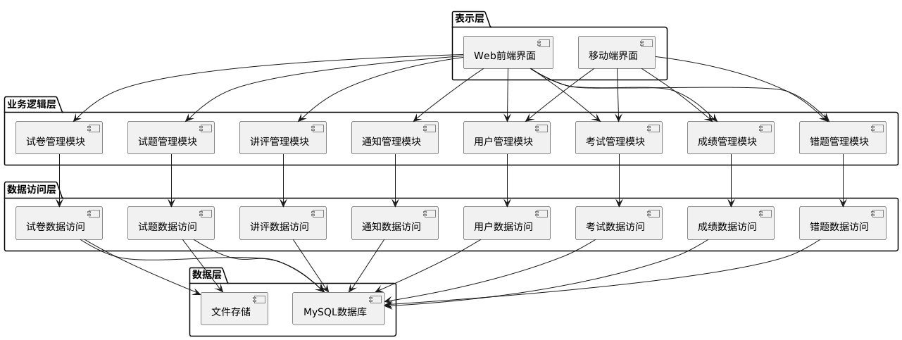
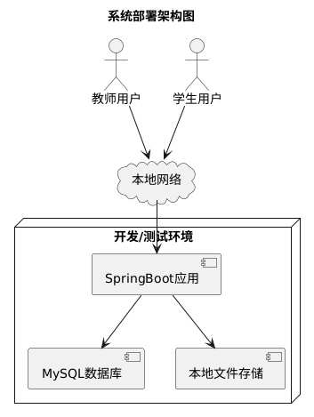
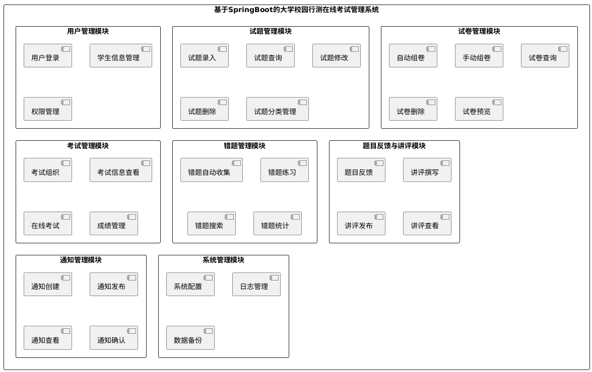
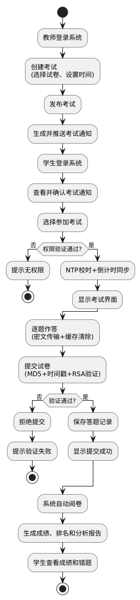
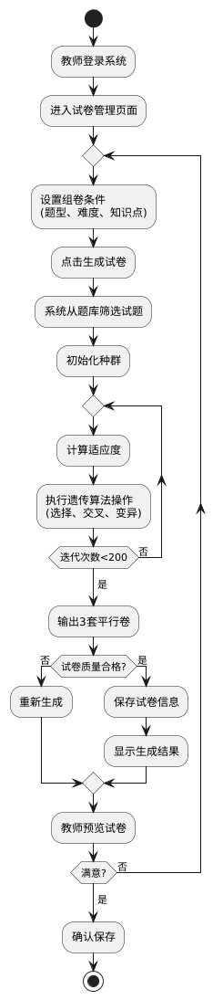
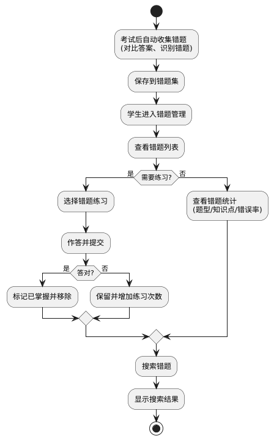
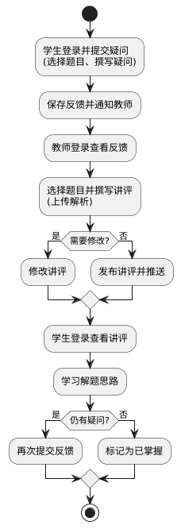
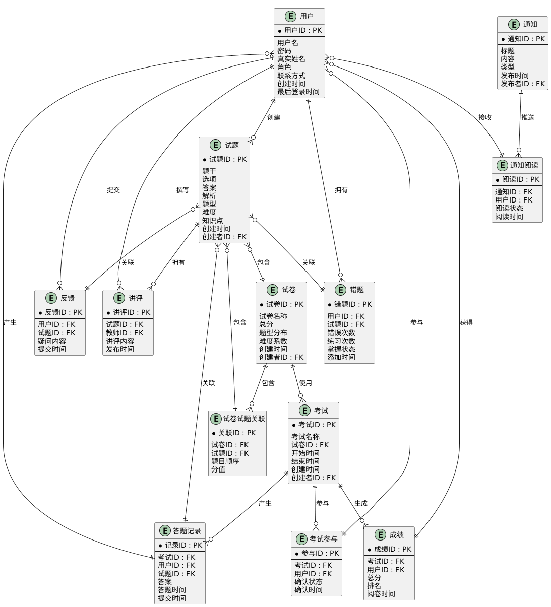

> 基于SpringBoot 的大学校园行测在线考试管理系统系统的概要设计
>
> 1 设计的目的与原则
>
> 1.1设计目的
>
> 1\. 明确系统架构：确定系统的总体架构、技术选型和分层设计，为系统开发提
> 供技术框架。
>
> 2\. 划分功能模块：将系统按照功能需求划分为若干功能模块，明确各模块的职
> 责和接口，实现模块内高内聚、模块间低耦合。
>
> 3\. 设计数据结构：完成数据库的概念设计和逻辑设计，建立完整的数据模型，
> 为数据持久化提供基础。
>
> 4\. 保证系统质量：通过合理的设计确保系统满足性能、安全性、可靠性等非功
> 能性需求。
>
> 1.2 设计原则
>
> 1\. 高内聚低耦合：各功能模块内部紧密相关，模块之间通过明确的接口进行交
> 互，减少模块间的依赖关系，提高系统的可维护性和可扩展性。
>
> 2\. 分层架构设计：采用经典的分层架构模式，将系统划分为表示层、业务逻辑
> 层、数据访问层和数据层，每层职责清晰，便于开发和维护。
>
> 3\.
> 安全性优先：针对行测考试的特殊性，采用多重防作弊机制，包括试题加密、
> 答案签名验证、时间同步等技术，确保考试的公平性和安全性。
>
> 4\. 可扩展性：系统采用模块化设计，支持功能扩展和性能扩展，能够适应未来
> 业务需求的变化和用户规模的增长。
>
> 5\. 用户体验优先：界面设计简洁直观，操作流程清晰，支持多种浏览器访问，
> 为教师和学生提供良好的使用体验。
>
> 6\.
> 性能优化：针对行测考试题量大、时间紧的特点，采用试题切片、缓存优化、
> 异步处理等技术，确保系统在高并发场景下的性能表现。
>
> 7\. 标准化设计：遵循软件工程规范和行业标准，使用统一的设计模式和编码规
> 范，确保代码质量和可维护性。
>
> 8\. 容错性设计：系统具备完善的异常处理机制和错误恢复能力，在网络中断、
> 服务器故障等异常情况下能够保证数据的完整性和一致性。
>
> 2 系统架构设计
>
> 2.1 总体架构
> 本系统采用基于SpringBoot的B/S架构，采用前后端分离的开发模式，支持多
> 用户并发访问。系统总体架构分为四层：表示层、业务逻辑层、数据访问层和数
> 据层。

> 图1 系统总体架构图
>
> 2.2 技术架构 2.2.1 技术选型 前端技术： 框架：Vue.js 3.x
>
> UI组件库：Element Plus 状态管理：Pinia 路由：Vue Router
> HTTP客户端：Axios 实时通信：WebSocket 图表库：ECharts
>
> 后端技术：
>
> 核心框架：Spring Boot 2.7.x ORM框架：MyBatis Plus 3.5.x
> 安全框架：Spring Security + JWT 消息队列：RabbitMQ 任务调度：Spring
> Task 文档生成：Swagger
>
> 日志：Logback
>
> 数据库： 关系型数据库：MySQL 8.0
>
> 开发工具： IDE：IntelliJ IDEA 2023 构建工具：Maven 3.8
> 接口测试：Postman
>
> 2.2.2 架构设计理由
> B/S架构：采用B/S架构，用户通过浏览器即可访问系统，无需安装客户端，降

> 低了部署和维护成本，支持跨平台访问。
> 前后端分离：前后端分离架构使前端和后端可以独立开发和部署，提高了开发效
> 率和系统的可维护性。前端专注于用户界面和交互，后端专注于业务逻辑和数据
> 处理。
> SpringBoot框架：SpringBoot简化了Spring应用的配置和部署，提供了自动配
> 置、嵌入式服务器等特性，能够快速构建企业级应用。
>
> MyBatis Plus：MyBatis Plus在MyBatis的基础上进行了增强，提供了通用的
> Mapper和Service，减少了重复代码的编写，提高了开发效率。
> WebSocket实时通信：WebSocket支持服务器与客户端之间的双向实时通信，用
> 于实现考试倒计时、实时通知等功能。
> 分层架构：分层架构使系统结构清晰，各层职责明确，便于开发、测试和维护。
> 表示层负责用户交互，业务逻辑层处理业务规则，数据访问层负责数据持久化，
> 数据层存储数据。
>
> 2.3 部署架构
>
> 图2 系统部署架构图
>
> 3 系统功能与业务流程设计
>
> 3.1 功能模块设计

> 图3 系统功能结构图
>
> 3.1.1 用户管理模块
> 用户管理模块负责系统用户的管理和权限控制，主要功能包括：
> 用户登录：支持教师和学生通过用户名、密码和验证码登录系统，系统验证用户
> 身份后颁发JWT令牌，用于后续接口调用的身份认证。
> 学生信息管理：教师可以添加、修改、删除和查询学生信息，包括学号、姓名、
> 联系方式等。系统支持批量导入学生信息。
> 权限管理：基于角色的访问控制（RBAC），系统预设教师和学生两种角色，教师
> 拥有所有管理权限，学生只能访问考试、成绩、错题等功能。
>
> 3.1.2 试题管理模块 试题管理模块负责试题库的管理和维护，主要功能包括：
>
> 试题录入：教师可以录入各类行测题目，包括言语理解、数量关系、判断推理、
> 资料分析、常识判断等题型。系统支持文本、图片等多种格式的题目内容。
> 试题查询：教师可以根据题型、难度、知识点等条件查询试题，支持模糊搜索和
> 组合查询。
>
> 试题修改：教师可以修改已录入的试题内容、答案、解析等信息。
> 试题删除：教师可以删除不再需要的试题，删除前会检查试题是否被试卷引用。
>
> 试题分类管理：系统支持按题型、难度、知识点等维度对试题进行分类管理，便
> 于试题的查询和组卷。
>
> 3.1.3 试卷管理模块 试卷管理模块负责试卷的创建和管理，主要功能包括：
> 自动组卷：使用改进NSGA-Ⅱ遗传算法自动生成试卷。
>
> 手动组卷：教师可以手动选择试题组合成试卷，系统会自动计算试卷的总分、题
> 型分布、难度系数等指标。
> 试卷查询：教师可以根据试卷名称、创建时间、题型分布等条件查询试卷。
> 试卷删除：教师可以删除不再需要的试卷，删除前会检查试卷是否被考试引用。
> 试卷预览：教师可以预览试卷的完整内容，包括题目顺序、分值分布等。
>
> 3.1.4 考试管理模块
> 考试管理模块是系统的核心模块，负责考试的全流程管理，主要功能包括：
> 考试组织：教师可以创建考试，选择试卷、设置考试时间、发布考试通知。系统
> 会自动生成考试通知并推送给相关学生。
> 考试信息查看：教师和学生可以查看考试列表和考试详情，包括考试时间、试卷
> 信息、参与人数等。
> 在线考试：学生可以在规定时间内参加在线考试。系统采用多种防作弊机制：
> 试题切片+SM4加密：将135题切成135个独立密文片段，每题一次随机Token，
> 客户端仅缓存当前一题，5秒后自动抹除。
> 答案签名验证：提交时前端只传"答案摘要MD5+时间戳"，真实答案走TLS双通
> 道，服务器用RSA私钥签名验证。
> NTP校时+WebSocket：通过NTP与校时服务器同步，WebSocket每秒推送倒计时，
> 断网5秒自动锁屏。
> 成绩管理：考试结束后系统自动阅卷，计算学生成绩并生成排名。教师和学生可
> 以查看成绩、排名和成绩分析报告。
>
> 3.1.5 错题管理模块 错题管理模块负责错题的收集和管理，主要功能包括：
>
> 错题自动收集：考试结束后，系统自动收集学生的错题，并存储在错题集中。
> 错题练习：学生可以针对错题集中的题目进行反复练习，系统会记录练习次数和
> 正确率。
> 错题搜索：学生可以根据题型、知识点等条件搜索错题，方便快速定位和复习。
> 错题统计：系统会统计学生的错题分布情况，包括题型分布、知识点分布、错误
> 率等，帮助学生了解自己的薄弱环节。
>
> 3.1.6 题目反馈与讲评模块
> 题目反馈与讲评模块负责题目反馈和教师讲评的管理，主要功能包括：
> 题目反馈：学生可以在答题过程中或答题结束后，选择有疑点、需要讲解的题目，
> 撰写疑问并提交给教师。
> 讲评撰写：教师可以查看学生的反馈，针对学生的问题撰写详细的讲评和解答。
> 讲评发布：教师将撰写好的讲评发布到系统中，供学生查看和学习。
>
> 讲评查看：学生可以查看教师发布的讲评，了解题目的解题思路和方法。
>
> 3.1.7 通知管理模块 通知管理模块负责系统通知的管理，主要功能包括：
> 通知创建：教师可以创建各类通知，包括考试通知、系统公告等。
>
> 通知发布：教师将创建好的通知发布到系统中，系统会自动推送给相关用户。
>
> 通知查看：用户可以查看系统发布的通知，支持按时间、类型等条件筛选。
> 通知确认：学生可以对查看到的通知进行确认操作，表示已阅读并了解通知内容。
>
> 3.1.8 系统管理模块 系统管理模块负责系统的配置和维护，主要功能包括：
>
> 系统配置：管理员可以配置系统的各项参数，包括考试时长、题型设置、难度等
> 级等。
> 日志管理：系统会记录用户的操作日志和系统运行日志，便于问题排查和审计。
> 数据备份：系统支持定期自动备份数据库数据，管理员也可以手动触发备份操作。
>
> 3.2 业务流程设计（对于核心业务，使用业务流程图或UML图描述完整的业务
> 流程）。
>
> 3.2.1 在线考试业务流程
> 在线考试是系统的核心业务，涉及教师发布考试、学生参加考试、系统自动阅卷
> 等多个环节。在线考试业务流程图如下：

> 图4 在线考试业务流程图
>
> 3.2.2 自动组卷业务流程
>
> 自动组卷使用改进 NSGA-Ⅱ遗传算法，根据教师设置的组卷条件自动生成试卷。
> 自动组卷业务流程图如下：

> 图5 自动组卷业务流程图
>
> 3.2.3 错题管理业务流程
> 错题管理业务流程包括错题自动收集、错题练习、错题统计等环节。错题管理业
> 务流程图如下：
>
> 图6 错题管理业务流程图
>
> 3.2.4 题目反馈与讲评业务流程
> 题目反馈与讲评业务流程包括学生提交反馈、教师撰写讲评、发布讲评等环节。

> 题目反馈与讲评业务流程图如下：
>
> 图7 题目反馈与讲评业务流程图
>
> 4 数据库设计
>
> 4.1 概念设计
>
> 通过对系统需求的分析，抽象出以下实体及其属性：
>
> 用户：用户 ID、用户名、密码、真实姓名、角色、联系方式、创建时间、最后
> 登录时间
>
> 试题：试题 ID、题干、选项、答案、解析、题型、难度、知识点、创建时间、
> 创建者
>
> 试卷：试卷ID、试卷名称、总分、题型分布、难度系数、创建时间、创建者
> 试卷试题关联：关联ID、试卷ID、试题ID、题目顺序、分值
> 考试：考试ID、考试名称、试卷ID、开始时间、结束时间、创建时间、创建者
> 考试参与：参与ID、考试ID、用户ID、确认状态、确认时间
> 答题记录：记录ID、考试ID、用户ID、试题ID、答案、答题时间、提交时间
> 成绩：成绩ID、考试ID、用户ID、总分、排名、阅卷时间
> 错题：错题ID、用户ID、试题ID、错误次数、练习次数、掌握状态、添加时间
> 反馈：反馈ID、用户ID、试题ID、疑问内容、提交时间
> 讲评：讲评ID、试题ID、教师ID、讲评内容、发布时间
> 通知：通知ID、标题、内容、类型、发布时间、发布者
>
> 实体之间的关系如下： 用户与试题：一对多关系，一个用户可以创建多个试题
>
> 试题与试卷：多对多关系，一个试题可以被多个试卷使用，一个试卷包含多个试
> 题
>
> 试卷与考试：一对多关系，一个试卷可以被多个考试使用
> 考试与用户：多对多关系，一个考试可以有多个用户参与，一个用户可以参与多
> 个考试
>
> 考试与答题记录：一对多关系，一个考试有多个答题记录
> 用户与答题记录：一对多关系，一个用户有多个答题记录
> 用户与错题：一对多关系，一个用户有多个错题
> 用户与反馈：一对多关系，一个用户可以提交多个反馈
> 试题与反馈：一对多关系，一个试题可以有多个反馈
> 试题与讲评：一对多关系，一个试题可以有多个讲评
> 教师与讲评：一对多关系，一个教师可以撰写多个讲评
> 用户与通知：多对多关系，一个通知可以发送给多个用户，一个用户可以接收多
> 个通知
>
> 系统E-R图如下：

> 图8 系统ER图
>
> 4.2 逻辑设计（将E-R模型转换为关系模型，设计数据库表结构)
> 将E-R模型转换为关系模型，设计以下数据库表结构：
>
> 4.2.1 用户表（sys_user）

||
||
||
||
||
||
||
||

||
||
||
||
||
||
||
||
||

> 4.2.2 试题表（question）

||
||
||
||
||
||
||
||
||
||
||
||
||
||
||
||

> 4.2.3 试卷表（paper）

||
||
||
||
||
||
||
||
||
||

||
||
||
||
||
||

> 4.2.4 试卷试题关联表（paper_question）

||
||
||
||
||
||
||
||

> 4.2.5 考试表（exam）

||
||
||
||
||
||
||
||
||
||
||
||
||

> 4.2.6 考试参与表（exam_participation）

||
||
||
||
||
||
||
||

> 4.2.7 答题记录表（answer_record）

||
||
||
||
||
||
||
||
||
||
||

> 4.2.8 成绩表（score）

||
||
||
||
||
||
||
||
||

> 4.2.9 错题表（wrong_question）

||
||
||
||
||
||
||
||
||
||
||

> 4.2.10 反馈表（feedback）

||
||
||
||

||
||
||
||
||
||
||

> 4.2.11 讲评表（review）

||
||
||
||
||
||
||
||

> 4.2.12 通知表（notice）

||
||
||
||
||
||
||
||
||

> 4.2.13 通知阅读表（notice_read）

||
||
||
||
||
||
||
||

> 5 非功能性设计
>
> 5.1 性能设计 为满足系统性能需求，采用以下性能优化措施：
>
> 数据库优化：
> 建立合适的索引：在用户表的username字段、试题表的question_type和
> difficulty字段、考试表的start_time和end_time字段等建立索引，提高查
> 询效率。
> 分库分表：当数据量达到一定规模时，对答题记录表、错题表等大表进行分库分
> 表，提高查询和写入性能。
> 读写分离：采用MySQL主从复制，主库负责写操作，从库负责读操作，提高系统
> 并发能力。
>
> 缓存优化：
> 使用Redis缓存热点数据，如试题信息、试卷信息、考试信息等，减少数据库查
> 询压力。
>
> 使用Redis缓存用户会话信息，提高用户登录验证速度。
> 使用Redis缓存考试倒计时信息，通过WebSocket实时推送给客户端。
>
> 异步处理：
> 使用RabbitMQ消息队列处理耗时操作，如自动阅卷、成绩计算、排名生成等，
> 提高系统响应速度。
>
> 使用Spring Task定时任务处理数据统计、数据备份等后台任务。
>
> 前端优化： 使用Vue.js的虚拟DOM技术，减少页面渲染时间。
> 使用懒加载和路由懒加载，减少首屏加载时间。 使用CDN加速静态资源加载。
>
> 试题切片优化：
> 将135题切成135个独立密文片段，每题独立传输，减少单次数据传输量。
> 客户端仅缓存当前一题，5秒后自动抹除，减少内存占用。
>
> 5.2 安全性设计 为满足系统安全性需求，采用以下安全措施：
>
> 身份认证：
>
> 使用JWT（JSON Web Token）进行身份认证，用户登录后颁发JWT令牌，后续接
> 口调用携带令牌进行身份验证。
>
> JWT令牌设置有效期，过期后需要重新登录。
> 使用BCrypt算法对用户密码进行加密存储，防止密码泄露。
>
> 权限控制：
> 基于角色的访问控制（RBAC），系统预设教师和学生两种角色，不同角色拥有不
> 同的权限。
>
> 使用Spring Security框架实现权限控制，在Controller层使用注解进行权限
> 验证。
>
> 数据加密： 使用SM4对称加密算法对试题内容进行加密，防止试题泄露。
> 每题使用一次随机Token，防止重放攻击。
> 使用HTTPS协议传输数据，防止数据被窃听和篡改。
>
> 答案签名验证：
> 提交时前端只传"答案摘要MD5+时间戳"，真实答案走TLS双通道。
> 服务器使用RSA私钥对"摘要+时间戳+用户ID"做签名，返回签名串。
> 服务器验证签名和时间窗（60秒），任何重放均会因时间窗失效而拒绝。
>
> 防SQL注入：
>
> 使用MyBatis Plus的预编译SQL功能，防止SQL注入攻击。
> 对用户输入进行严格验证和过滤，防止恶意输入。
>
> 防XSS攻击： 对用户输入进行HTML转义，防止XSS攻击。
>
> 使用CSP（Content Security Policy）策略，限制页面可以加载的资源。
>
> 日志审计：
> 记录用户的操作日志，包括登录、操作、退出等，便于审计和问题排查。
> 记录系统运行日志，包括错误日志、警告日志等，便于系统监控和维护。
>
> 5.3 可靠性设计 为满足系统可靠性需求，采用以下可靠性措施：
>
> 数据备份： 支持手动触发备份操作，管理员可以在需要时手动备份数据。
> 备份数据存储在独立的存储服务器上，防止主服务器故障导致数据丢失。
>
> 异常处理：
> 系统具备完善的异常处理机制，捕获并记录所有异常信息，防止系统崩溃。
> 对网络异常、数据库异常等常见异常进行特殊处理，提供友好的错误提示。
>
> 容错设计：
> 使用事务保证数据的一致性，当操作失败时回滚事务，保证数据完整性。
> 使用消息队列的持久化功能，防止消息丢失。
> 使用Redis的持久化功能，防止缓存数据丢失。
>
> 监控告警：
> 使用Prometheus和Grafana监控系统运行状态，包括CPU、内存、磁盘、网络
> 等资源使用情况。
>
> 设置告警规则，当资源使用超过阈值时发送告警通知。
>
> 负载均衡：
> 使用Nginx作为负载均衡器，将请求分发到多个应用服务器，提高系统的并发能
> 力和可用性。
> 应用服务器采用集群部署，当某台服务器故障时，其他服务器可以继续提供服务。
>
> 5.4 易用性设计 为满足系统易用性需求，采用以下易用性措施：
>
> 界面设计： 采用简洁直观的界面设计，符合用户的使用习惯。 使用Element
> Plus组件库，提供统一的UI风格和交互体验。
> 响应式设计，支持PC端和移动端访问。
>
> 操作流程： 操作流程清晰，提供明确的操作指引和提示信息。
>
> 支持批量操作，如批量导入学生、批量删除试题等，提高操作效率。
> 提供搜索和筛选功能，方便用户快速查找所需信息。
>
> 帮助文档： 提供在线帮助文档，详细介绍系统的使用方法和注意事项。
> 提供操作指引，引导用户完成常用操作。
>
> 5.5 可扩展性设计 为满足系统可扩展性需求，采用以下可扩展性措施：
>
> 模块化设计： 系统采用模块化设计，各功能模块独立，便于功能扩展和维护。
> 使用Spring Boot的自动配置和依赖注入，降低模块间的耦合度。
>
> 微服务架构： 系统采用微服务架构，各功能模块可以独立部署和扩展。
> 使用Spring Cloud实现服务注册、服务发现、负载均衡等功能。
>
> 水平扩展：
> 应用服务器支持水平扩展，可以通过增加服务器数量提高系统的并发能力。
> 数据库支持读写分离和分库分表，可以通过增加数据库服务器提高系统的数据处
> 理能力。
>
> 6 小结
>
> 本概要设计文档在需求分析的基础上，完成了基于SpringBoot的大学校园行测
> 在线考试管理系统的总体设计。文档从系统架构设计、功能模块设计、业务流程
> 设计、数据库设计和非功能性设计等方面进行了详细阐述。
>
> 系统采用基于SpringBoot的B/S架构，采用前后端分离的开发模式，支持多用
> 户并发访问。系统划分为8个主要功能模块：用户管理模块、试题管理模块、试
> 卷管理模块、考试管理模块、错题管理模块、题目反馈与讲评模块、通知管理模
> 块和系统管理模块。每个模块内部包含若干子功能，实现了模块内高内聚、模块
> 间低耦合。
>
> 系统采用改进NSGA-Ⅱ遗传算法实现自动组卷，采用试题切片+SM4加密、MD5摘
> 要+RSA签名、NTP校时+WebSocket等技术实现行测专属的防作弊机制，确保考
> 试的公平性和安全性。
> 数据库设计包括13张表，涵盖了用户、试题、试卷、考试、答题记录、成绩、
> 错题、反馈、讲评、通知等核心数据实体，建立了完整的E-R模型，并转换为关
> 系模型。
> 非功能性设计从性能、安全性、可靠性、易用性、可扩展性等方面进行了详细设
> 计，采用缓存优化、异步处理、数据备份、异常处理、负载均衡等技术措施，确
> 保系统满足各项非功能性需求。
> 本概要设计文档为后续的详细设计和编码实现提供了清晰的指导，为系统的开发
> 和维护奠定了坚实的基础。
>
> 参考资料
>
> \[1\]戴毅. 基于SpringBoot+Vue的在线考试系统设计与实现\[J\].
> 数字技术与应 用, 2024, 42(04): 90-92.
>
> \[2\]韩瑞, 王利强. 基于Java的在线考试系统设计与实现\[J\].
> 工业控制计算机, 2024, 37(09): 146-147.
>
> \[3\]姜一波. 基于SpringBoot+Vue的在线考试系统设计与实现\[J\].
> 无线互联科 技, 2023, 20(23): 68-71.
>
> \[4\]唐媛媛, 王晓楠, 李京培, 等. 基于SpringBoot的病原生物学在线智能化
> 实验考试系统建设探索\[J\]. 赤峰学院学报(自然科学版), 2023, 39(12):
>
> 75-78.
>
> \[5\]王霏儿. 基于SpringBoot的在线考试系统设计与实现\[D\]. 南昌:
> 江西师范 大学, 2023.
>
> \[6\]吴晓云, 袁昊东. 基于Spring Boot的在线考试管理系统\[J\].
> 微型电脑应用, 2024, 40(11): 199-204.
>
> \[7\]Md. Monarul Islam, Saifuddin Khaled Nabil, Saydul Akbar Murad, et
> al. The Development and Deployment of an Online Exam System: A Web
> Application\[J\]. Asian Journal of Research in Computer Science, 2023,
> 16(2): 1-11.
>
> \[8\]吴敏希. 《行政能力测试》在线备考系统的分析和设计\[D\]. 南昌:
> 南昌大学, 2016.
>
> \[9\]张俊. 基于Java的公务员备考微信小程序\[J\]. 电脑知识与技术, 2022,
> 18(04): 112-114.
>
> \[10\]张海藩, 牟永敏. 软件工程导论\[M\]. 6版. 北京: 清华大学出版社,
> 2013.
