> 基于SpringBoot 的大学校园行测在线考试管理系统的详细设计
>
> 1 详细设计的目的与原则
>
> 1.1 详细设计的目的
> 详细设计是在概要设计的基础上，对系统进行更加具体、详细地设计，为后续的
> 编码实现提供直接的指导。本详细设计文档的主要目的包括：
>
> ⚫ 指导编码实现：为开发人员提供详细的技术实现方案，包括功能模块的具体
> 实现细节、数据结构设计、接口定义等，使开发工作有章可循。
>
> ⚫ 确保系统质量：通过详细的设计和审查，提前发现并解决潜在的技术问题和
> 逻辑漏洞，确保系统的可靠性、安全性和性能。
>
> ⚫ 便于测试和维护：详细设计文档为测试人员提供了测试的依据，也为后续的
> 系统维护和升级提供了参考资料。
>
> ⚫ 符合软件工程规范：遵循软件工程的最佳实践，确保系统开发过程的规范化
> 和标准化，提高开发效率和代码质量。
>
> 1.2 详细设计的原则 在详细设计过程中，遵循以下原则：
>
> ⚫ 准确性：详细设计文档必须准确反映系统的功能需求和技术实现方案，确保
> 设计与需求的一致性。
>
> ⚫ 完整性：详细设计文档应覆盖系统的所有功能模块和技术细节，确保没有遗
> 漏。
>
> ⚫ 可操作性：详细设计文档应具有可操作性，开发人员可以直接按照文档进行
> 编码实现。
>
> ⚫ 模块化：采用模块化设计，将系统分解为独立的、可管理的模块，每个模块
> 职责明确，接口清晰。
>
> ⚫ 可读性：详细设计文档应结构清晰，文字流畅，图表规范，便于开发人员和
> 其他相关人员理解。
>
> ⚫ 可维护性：设计应考虑系统的可维护性，采用易于理解和修改的设计方案，
> 减少后续维护的工作量。
>
> ⚫ 性能优化：在设计过程中考虑系统的性能需求，采取必要的性能优化措施，
> 确保系统在高并发场景下的稳定性和响应速度。
>
> 2 系统详细设计 2.1 用户管理模块 2.1.1 用户登录 功能详细设计：
>
> 用户登录是系统的入口功能，用于验证用户身份并授予访问权限。

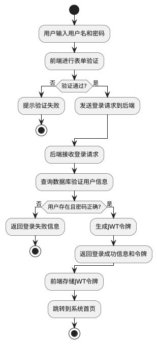

> 图1 用户登录流程图

实现细节： 前端实现：

> 使用Vue.js 组件实现登录表单 表单验证：检查用户名和密码是否为空
>
> 使用Axios 发送POST 请求到/api/auth/login 接收响应，存储JWT
> 令牌到localStorage 根据响应结果进行页面跳转
>
> 后端实现：
>
> 控制器：AuthController.login()处理登录请求
> 服务层：AuthService.authenticate()验证用户身份
> 数据访问：UserMapper.selectByUsername()查询用户信息 安全：使用BCrypt
> 加密密码，JWT 生成和验证 响应：返回登录结果和JWT 令牌
>
> 数据库操作：
>
> 查询用户表：SELECT \* FROM user WHERE username = ?
> 验证密码：使用BCrypt 比较加密后的密码
>
> 2.1.2 学生信息管理 功能详细设计：
>
> 学生信息管理功能允许教师添加、修改、删除和查询学生信息。

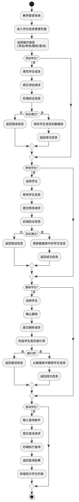

> 图2 学生信息管理流程图

实现细节： 前端实现：

> 使用Vue.js 组件实现学生信息管理界面
> 实现添加、修改、删除、查询功能的表单和按钮 使用Axios
> 发送相应的请求到后端API 处理后端响应，显示操作结果
>
> 后端实现：
>
> 控制器：StudentController 处理学生信息管理请求 服务层：StudentService
> 实现业务逻辑 数据访问：StudentMapper 操作数据库 验证：使用Spring
> Validation 验证学生信息 权限控制：使用Spring Security
> 确保只有教师可以操作
>
> 数据库操作：
>
> 添加：INSERT INTO student (id, name, username, password, phone, email)
> VALUES (?, ?, ?, ?, ?, ?)
>
> 修改：UPDATE student SET name = ?, phone = ?, email = ? WHERE id = ?
> 删除：DELETE FROM student WHERE id = ?
>
> 查询：SELECT \* FROM student WHERE name LIKE ? OR username LIKE ?
>
> 2.1.3 权限管理 功能详细设计：
>
> 权限管理功能用于管理用户的角色和权限，确保用户只能访问其授权的功能。

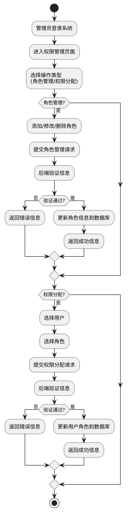

> 图3 权限管理流程图

实现细节： 前端实现：

> 使用Vue.js 组件实现权限管理界面 实现角色管理和权限分配的表单和按钮
> 使用Axios 发送相应的请求到后端API 处理后端响应，显示操作结果
>
> 后端实现：
>
> 控制器：RoleController 和PermissionController 处理权限管理请求
> 服务层：RoleService 和PermissionService 实现业务逻辑
> 数据访问：RoleMapper 和PermissionMapper 操作数据库
> 权限控制：使用Spring Security 确保只有管理员可以操作
>
> 数据库操作：
>
> 角色管理：INSERT INTO role (id, name, description) VALUES (?, ?, ?)
> 权限分配：INSERT INTO user_role (user_id, role_id) VALUES (?, ?)
> 权限验证：SELECT \* FROM user_role ur JOIN role_permission rp ON
> ur.role_id = rp.role_id WHERE ur.user_id = ? AND rp.permission_id = ?
>
> 2.2 试题管理模块 2.2.1 试题录入 功能详细设计：
>
> 试题录入功能允许教师添加新的试题到系统中。

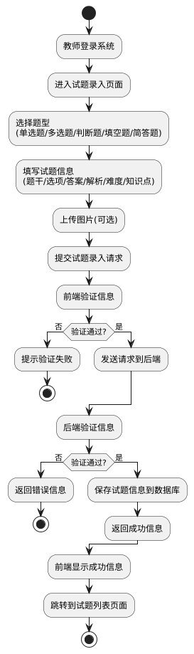

> 图4 试题录入流程图

实现细节： 前端实现：

> 使用Vue.js 组件实现试题录入界面 根据题型动态显示不同的表单字段
> 实现图片上传功能
>
> 使用Axios 发送POST 请求到/api/question/add 处理后端响应，显示操作结果
>
> 后端实现： 控制器：QuestionController.addQuestion()处理试题录入请求
> 服务层：QuestionService.addQuestion()实现业务逻辑
> 数据访问：QuestionMapper.insert()操作数据库 验证：使用Spring
> Validation 验证试题信息 文件处理：处理图片上传，存储到本地文件系统
>
> 数据库操作：
>
> 插入试题：INSERT INTO question (id, content, type, difficulty,
> knowledge_point, answer, analysis, image_url, create_time, create_by)
> VALUES (?, ?, ?, ?, ?, ?, ?, ?, ?, ?)
>
> 插入选项：INSERT INTO option (id, question_id, content, is_correct)
> VALUES (?, ?, ?, ?)
>
> 2.2.2 试题查询 功能详细设计：
>
> 试题查询功能允许教师根据条件查询试题。

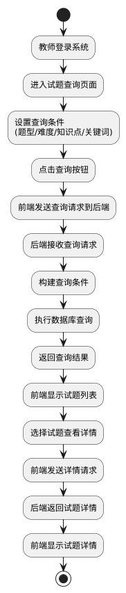

> 图5 试题查询流程图
>
> 实现细节：
>
> 前端实现：
>
> 使用Vue.js 组件实现试题查询界面 实现查询条件的表单和按钮
>
> 使用Axios 发送GET 请求到/api/question/list 处理后端响应，显示试题列表
> 实现试题详情查看功能
>
> 后端实现： 控制器：QuestionController.listQuestions()处理查询请求
> 服务层：QuestionService.listQuestions()实现业务逻辑
> 数据访问：QuestionMapper.selectByCondition()操作数据库
> 分页：使用MyBatis Plus 的分页插件实现分页查询
>
> 数据库操作：
>
> 查询：SELECT \* FROM question WHERE type = ? AND difficulty = ? AND
> knowledge_point LIKE ? AND content LIKE ? LIMIT ? OFFSET ?
>
> 详情：SELECT \* FROM question WHERE id = ? 选项：SELECT \* FROM option
> WHERE question_id = ?
>
> 2.2.3 试题修改 功能详细设计：
>
> 试题修改功能允许教师修改已存在的试题信息。

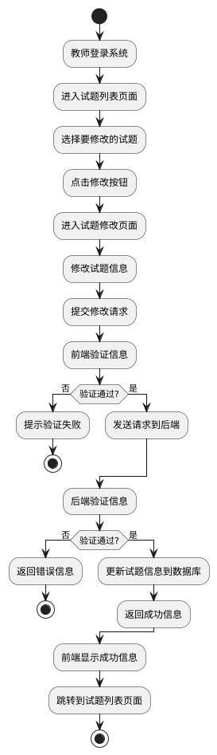

> 图6 试题修改流程图

实现细节： 前端实现：

> 使用Vue.js 组件实现试题修改界面 预填充要修改的试题信息
> 实现图片上传和修改功能
>
> 使用Axios 发送PUT 请求到/api/question/update
> 处理后端响应，显示操作结果
>
> 后端实现： 控制器：QuestionController.updateQuestion()处理修改请求
> 服务层：QuestionService.updateQuestion()实现业务逻辑
> 数据访问：QuestionMapper.update()操作数据库 验证：使用Spring
> Validation 验证修改后的试题信息
>
> 数据库操作：
>
> 更新试题：UPDATE question SET content = ?, type = ?, difficulty = ?,
> knowledge_point = ?, answer = ?, analysis = ?, image_url = ? WHERE id
> = ?
>
> 更新选项：UPDATE option SET content = ?, is_correct = ? WHERE id = ?
> 删除旧选项：DELETE FROM option WHERE question_id = ?
>
> 添加新选项：INSERT INTO option (id, question_id, content, is_correct)
> VALUES (?, ?, ?, ?)
>
> 2.2.4 试题删除 功能详细设计：
>
> 试题删除功能允许教师删除不再需要的试题。

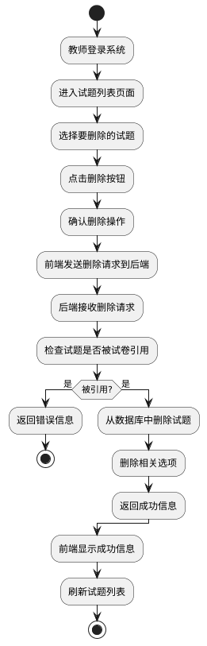

> 图7 试题删除流程图
>
> 实现细节：
>
> 前端实现：
>
> 使用Vue.js 组件实现试题列表页面 实现删除按钮和确认对话框
>
> 使用Axios 发送DELETE 请求到/api/question/delete/{id}
> 处理后端响应，显示操作结果
>
> 后端实现： 控制器：QuestionController.deleteQuestion()处理删除请求
> 服务层：QuestionService.deleteQuestion()实现业务逻辑
> 数据访问：QuestionMapper.delete()操作数据库
> 检查引用：查询试题是否被试卷使用
>
> 数据库操作：
>
> 检查引用：SELECT COUNT(\*) FROM paper_question WHERE question_id = ?
> 删除选项：DELETE FROM option WHERE question_id = ? 删除试题：DELETE
> FROM question WHERE id = ?
>
> 2.3 试卷管理模块 2.3.1 自动组卷 功能详细设计：
>
> 自动组卷以“题目 ID 序列”为染色体，初始化按题型/知识点/难度比例随机抽
> 题并做可行性修复；适应度设为多目标：难度偏差最小、知识点覆盖最大、题型
> 比例误差最小、总分误差最小，硬约束（重复题、超时、必选题）用罚分+修复。
> 每代做非支配排序与拥挤距离选择，交叉用分段交换，变异用同标签题替换；加
> 入精英保留与早停，输出帕累托最优中最符合教师权重的一套试卷。

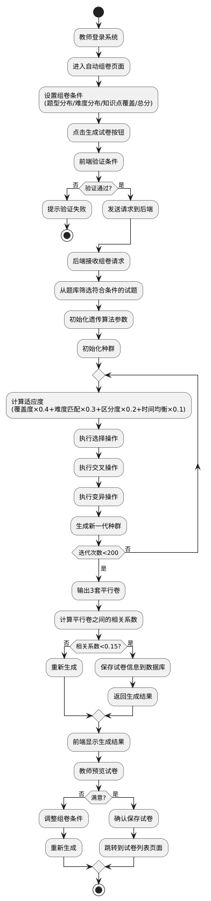

> 图7 自动组卷流程图

实现细节： 前端实现：

> 使用Vue.js 组件实现自动组卷界面 实现组卷条件的设置表单
>
> 使用Axios 发送POST 请求到/api/paper/autogenerate 显示组卷进度和结果
>
> 实现试卷预览功能
>
> 后端实现： 控制器：PaperController.autoGenerate()处理自动组卷请求
> 服务层：PaperService.autoGenerate()实现业务逻辑
> 算法实现：GeneticAlgorithm 类实现改进NSGA-Ⅱ算法 数据访问：PaperMapper
> 和QuestionMapper 操作数据库
>
> 数据库操作：
>
> 筛选试题：SELECT \* FROM question WHERE type = ? AND difficulty = ?
> AND knowledge_point LIKE ?
>
> 保存试卷：INSERT INTO paper (id, name, total_score, difficulty,
> create_time, create_by) VALUES (?, ?, ?, ?, ?, ?)
>
> 保存试卷试题关系：INSERT INTO paper_question (paper_id, question_id,
> score, sequence) VALUES (?, ?, ?, ?)
>
> 2.3.2 手动组卷 功能详细设计：
>
> 手动组卷功能允许教师手动选择试题组合成试卷。

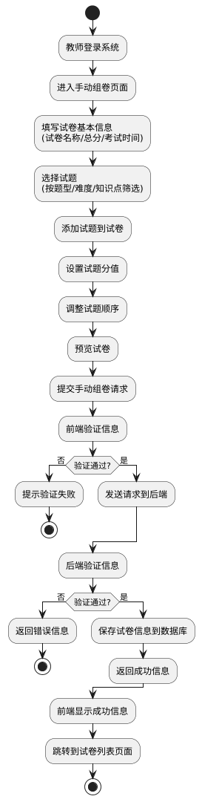

> 图8 手动组卷流程图

实现细节： 前端实现：

> 使用Vue.js 组件实现手动组卷界面 实现试卷基本信息表单
> 实现试题选择和管理界面
>
> 使用Axios 发送POST 请求到/api/paper/manualgenerate
> 处理后端响应，显示操作结果
>
> 后端实现： 控制器：PaperController.manualGenerate()处理手动组卷请求
> 服务层：PaperService.manualGenerate()实现业务逻辑
> 数据访问：PaperMapper 和QuestionMapper 操作数据库
> 验证：验证试卷信息和试题选择
>
> 数据库操作：
>
> 保存试卷：INSERT INTO paper (id, name, total_score, exam_time,
> create_time, create_by) VALUES (?, ?, ?, ?, ?, ?)
>
> 保存试卷试题关系：INSERT INTO paper_question (paper_id, question_id,
> score, sequence) VALUES (?, ?, ?, ?)
>
> 2.3.3 试卷查询 功能详细设计：
>
> 试卷查询功能允许教师根据条件查询试卷。

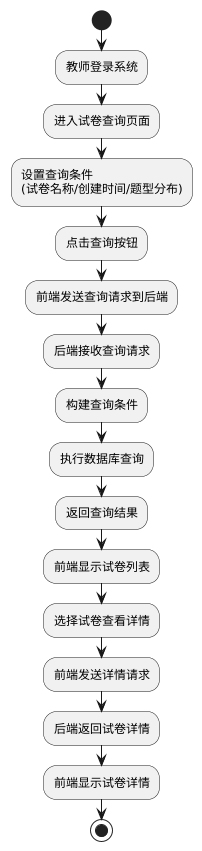

> 图9 试卷查询流程图 实现细节：
>
> 前端实现：
>
> 使用Vue.js 组件实现试卷查询界面 实现查询条件的表单和按钮
>
> 使用Axios 发送GET 请求到/api/paper/list 处理后端响应，显示试卷列表
> 实现试卷详情查看功能
>
> 后端实现： 控制器：PaperController.listPapers()处理查询请求
> 服务层：PaperService.listPapers()实现业务逻辑
> 数据访问：PaperMapper.selectByCondition()操作数据库 分页：使用MyBatis
> Plus 的分页插件实现分页查询
>
> 数据库操作：
>
> 查询：SELECT \* FROM paper WHERE name LIKE ? AND create_time BETWEEN ?
> AND ? LIMIT ? OFFSET ?
>
> 详情：SELECT \* FROM paper WHERE id = ?
>
> 试题：SELECT \* FROM paper_question pq JOIN question q ON
> pq.question_id = q.id WHERE pq.paper_id = ? ORDER BY pq.sequence
>
> 2.3.4 试卷删除 功能详细设计：
>
> 试卷删除功能允许教师删除不再需要的试卷。

> 图10 试卷删除流程图 实现细节：
>
> 前端实现：
>
> 使用Vue.js 组件实现试卷列表页面 实现删除按钮和确认对话框
>
> 使用Axios 发送DELETE 请求到/api/paper/delete/{id}
> 处理后端响应，显示操作结果
>
> 后端实现： 控制器：PaperController.deletePaper()处理删除请求
> 服务层：PaperService.deletePaper()实现业务逻辑
> 数据访问：PaperMapper.delete()操作数据库
> 检查引用：查询试卷是否被考试使用
>
> 数据库操作：
>
> 检查引用：SELECT COUNT(\*) FROM exam WHERE paper_id = ?
> 删除试题关系：DELETE FROM paper_question WHERE paper_id = ?
> 删除试卷：DELETE FROM paper WHERE id = ?
>
> 2.3.5 试卷预览 功能详细设计：
>
> 试卷预览功能允许教师预览试卷的完整内容，包括题目顺序、分值分布等。

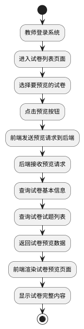

> 图11 试卷预览流程图

实现细节： 前端实现：

> 使用Vue.js 组件实现试卷预览界面
>
> 使用Axios 发送GET 请求到/api/paper/preview/{id}
> 渲染试卷预览页面，包括题目和选项
>
> 支持分页显示和打印功能
>
> 后端实现： 控制器：PaperController.previewPaper()处理预览请求
>
> 服务层：PaperService.getPaperWithQuestions()实现业务逻辑
> 数据访问：PaperMapper 和QuestionMapper 操作数据库
>
> 数据库操作：
>
> 试卷信息：SELECT \* FROM paper WHERE id = ?
>
> 试题列表：SELECT \* FROM paper_question pq JOIN question q ON
> pq.question_id = q.id JOIN option o ON q.id = o.question_id WHERE
> pq.paper_id = ? ORDER BY pq.sequence, o.id
>
> 2.4 考试管理模块
>
> 2.4.1 考试创建考试组织 功能详细设计：
>
> 考试组织功能允许教师创建考试，选择试卷、设置考试时间、发布考试通知。

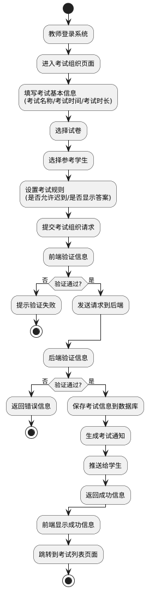

> 图12 考试组织流程图

实现细节： 前端实现：

> 使用Vue.js 组件实现考试组织界面 实现考试基本信息表单
> 实现试卷选择和学生选择功能
>
> 使用Axios 发送POST 请求到/api/exam/create 处理后端响应，显示操作结果
>
> 后端实现： 控制器：ExamController.createExam()处理考试组织请求
> 服务层：ExamService.createExam()实现业务逻辑 数据访问：ExamMapper
> 和NoticeMapper 操作数据库 消息推送：使用WebSocket 或邮件推送考试通知
>
> 数据库操作：
>
> 保存考试：INSERT INTO exam (id, name, paper_id, start_time, end_time,
> duration, create_time, create_by) VALUES (?, ?, ?, ?, ?, ?, ?, ?)
>
> 保存考试学生关系：INSERT INTO exam_student (exam_id, student_id)
> VALUES (?, ?) 生成通知：INSERT INTO notice (id, title, content, type,
> create_time, create_by) VALUES (?, ?, ?, ?, ?, ?)
>
> 2.4.2 考试信息查看 功能详细设计：
>
> 考试信息查看功能允许教师和学生查看考试列表和考试详情。

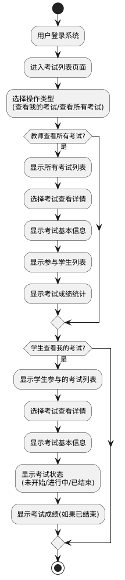

> 图13 考试信息查看流程图

实现细节： 前端实现：

> 使用Vue.js 组件实现考试列表和详情页面 根据用户角色显示不同的考试列表
>
> 使用Axios 发送GET 请求到/api/exam/list 和/api/exam/detail/{id}
> 处理后端响应，显示考试信息
>
> 后端实现：
> 控制器：ExamController.listExams()和ExamController.getExamDetail()处理查看请求
> 服务层：ExamService.listExamsByUser()和ExamService.getExamDetail()实现业务逻
> 辑
>
> 数据访问：ExamMapper 和ScoreMapper 操作数据库
> 权限控制：根据用户角色返回相应的考试信息
>
> 数据库操作：
>
> 教师查询：SELECT \* FROM exam ORDER BY create_time DESC
>
> 学生查询：SELECT \* FROM exam e JOIN exam_student es ON e.id =
> es.exam_id WHERE es.student_id = ? ORDER BY e.start_time DESC
>
> 详情查询：SELECT \* FROM exam WHERE id = ?
>
> 学生列表：SELECT \* FROM exam_student es JOIN student s ON
> es.student_id = s.id WHERE es.exam_id = ?
>
> 2.4.3 在线考试 功能详细设计：
>
> 在线考试按“开考校验、计时作答、实时监控、交卷判分”走。学生进入后校验
> 身份与考试口令，生成一次性答题令牌并锁定试卷；前端倒计时与定时自动保存，
> 断网本地缓存、恢复后续传。防作弊启用切屏/失焦次数统计、全屏限制、禁止
> 复制粘贴、随机题序与选项乱序；异常行为实时记录并触发告警。到时自动交卷，
> 客观题自动判分，主观题进入人工批改。

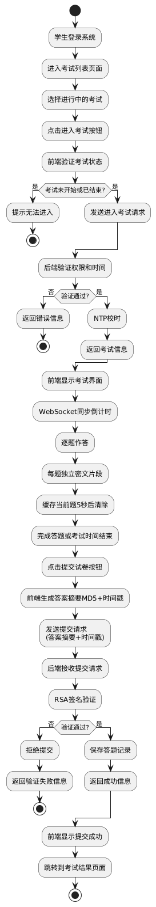

> 图14 在线考试流程图

实现细节： 前端实现：

> 使用Vue.js 组件实现考试界面 实现逐题作答功能 实现WebSocket
> 连接，接收倒计时 实现答案加密和提交功能 处理后端响应，显示考试结果
>
> 后端实现：
> 控制器：ExamController.enterExam()和ExamController.submitExam()处理考试请求
> 服务层：ExamService.enterExam()和ExamService.submitExam()实现业务逻辑
> 数据访问：ExamMapper 和AnswerMapper 操作数据库
>
> 安全：实现RSA 签名验证和防作弊机制
>
> 数据库操作：
>
> 进入考试：UPDATE exam_student SET status = '参加中' WHERE exam_id = ?
> AND student_id = ?
>
> 提交答案：INSERT INTO answer (id, exam_id, student_id, question_id,
> answer, submit_time) VALUES (?, ?, ?, ?, ?, ?)
>
> 保存答题记录：INSERT INTO exam_record (id, exam_id, student_id,
> start_time, end_time, status) VALUES (?, ?, ?, ?, ?, ?)
>
> 2.4.4 成绩管理 功能详细设计：
>
> 成绩管理功能允许系统自动阅卷，计算学生成绩并生成排名，教师和学生可以查
> 看成绩、排名和成绩分析报告。

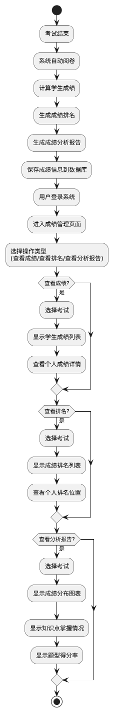

> 图15 成绩管理流程图

实现细节： 前端实现：

> 使用Vue.js 组件实现成绩管理界面 使用ECharts 实现成绩分析图表
>
> 使用Axios 发送GET 请求到/api/score/list 和/api/score/analysis/{examId}
> 处理后端响应，显示成绩信息和分析报告
>
> 后端实现：
>
> 控制器：ScoreController 处理成绩管理请求 服务层：ScoreService
> 实现业务逻辑 数据访问：ScoreMapper 和AnswerMapper 操作数据库
> 自动阅卷：实现自动批改客观题的逻辑
>
> 数据库操作：
>
> 保存成绩：INSERT INTO score (id, exam_id, student_id, score, rank,
> create_time) VALUES (?, ?, ?, ?, ?, ?)
>
> 查询成绩：SELECT \* FROM score WHERE exam_id = ? ORDER BY score DESC
> 查询个人成绩：SELECT \* FROM score WHERE exam_id = ? AND student_id =
> ? 分析报告：SELECT question.type, AVG(CASE WHEN answer.answer =
> question.answer THEN paper_question.score ELSE 0 END) as avg_score
> FROM answer JOIN question ON answer.question_id = question.id JOIN
> paper_question ON question.id = paper_question.question_id WHERE
> answer.exam_id = ? GROUP BY question.type
>
> 2.5 错题管理模块
>
> 2.5.1 错题收集错题自动收集 功能详细设计：
>
> 错题自动收集功能在考试结束后自动收集学生的错题，并存储在错题集中。

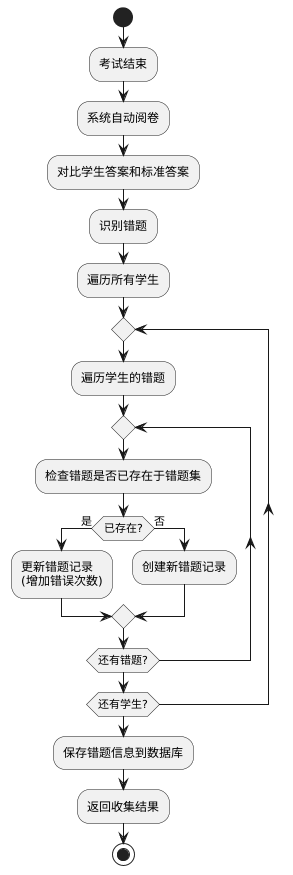

> 图16 错题自动收集流程图

实现细节： 前端实现：

> 无需前端操作，由系统自动执行 学生可以在错题集页面查看自动收集的错题
>
> 后端实现： 服务层：WrongQuestionService.autoCollect()实现自动收集逻辑
> 数据访问：WrongQuestionMapper 和AnswerMapper 操作数据库
> 定时任务：使用Spring Task 在考试结束后执行自动收集
>
> 数据库操作：
>
> 识别错题：SELECT \* FROM answer a JOIN question q ON a.question_id =
> q.id WHERE a.exam_id = ? AND a.answer != q.answer
>
> 检查存在：SELECT \* FROM wrong_question WHERE student_id = ? AND
> question_id = ?
>
> 创建错题：INSERT INTO wrong_question (id, student_id, question_id,
> error_count, first_error_time, last_error_time) VALUES (?, ?, ?, ?, ?,
> ?)
>
> 更新错题：UPDATE wrong_question SET error_count = error_count + 1,
> last_error_time = ? WHERE id = ?
>
> 2.5.2 错题练习 功能详细设计：
>
> 错题练习功能允许学生针对错题集中的题目进行反复练习，系统会记录练习次数
> 和正确率。

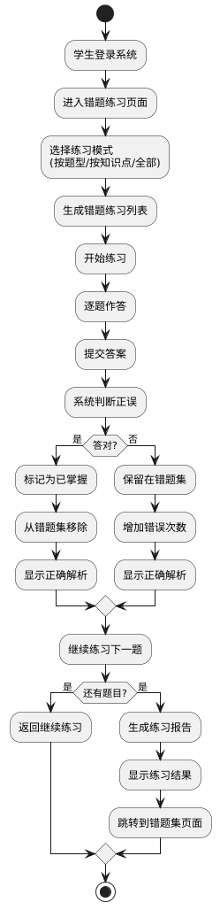

> 图17 错题练习流程图

实现细节： 前端实现：

使用Vue.js 组件实现错题练习界面 实现练习模式选择和错题练习功能

> 使用Axios 发送POST 请求到/api/wrongquestion/practice
> 处理后端响应，显示练习结果
>
> 后端实现： 控制器：WrongQuestionController.practice()处理错题练习请求
> 服务层：WrongQuestionService.practice()实现业务逻辑
> 数据访问：WrongQuestionMapper 操作数据库 验证：验证学生答案的正确性
>
> 数据库操作：
>
> 获取错题：SELECT \* FROM wrong_question wq JOIN question q ON
> wq.question_id = q.id WHERE wq.student_id = ? AND q.type = ? ORDER BY
> wq.last_error_time DESC
>
> 标记掌握：DELETE FROM wrong_question WHERE id = ?
>
> 更新错误次数：UPDATE wrong_question SET error_count = error_count + 1,
> last_error_time = ? WHERE id = ?
>
> 2.5.3 错题搜索 功能详细设计：
>
> 错题搜索功能允许学生根据题型、知识点等条件搜索错题，方便快速定位和复习。

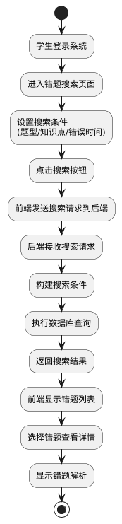

> 图18 错题搜索流程图 实现细节：
>
> 前端实现：
>
> 使用Vue.js 组件实现错题搜索界面 实现搜索条件表单和按钮
>
> 使用Axios 发送GET 请求到/api/wrongquestion/search
> 处理后端响应，显示搜索结果
>
> 后端实现： 控制器：WrongQuestionController.search()处理搜索请求
> 服务层：WrongQuestionService.search()实现业务逻辑
> 数据访问：WrongQuestionMapper 操作数据库
>
> 数据库操作：
>
> 搜索错题：SELECT \* FROM wrong_question wq JOIN question q ON
> wq.question_id = q.id WHERE wq.student_id = ? AND q.type = ? AND
> q.knowledge_point LIKE ? AND wq.first_error_time BETWEEN ? AND ?
>
> 错题详情：SELECT \* FROM wrong_question wq JOIN question q ON
> wq.question_id = q.id WHERE wq.id = ?
>
> 2.5.4 错题统计 功能详细设计：
>
> 错题统计功能允许学生查看错题的分布情况，包括题型分布、知识点分布、错误
> 率等，帮助学生了解自己的薄弱环节。

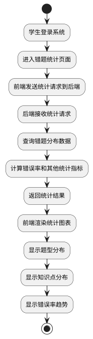

> 图19 错题统计流程图

实现细节： 前端实现：

> 使用Vue.js 组件实现错题统计界面 使用ECharts 实现统计图表
>
> 使用Axios 发送GET 请求到/api/wrongquestion/statistics
> 处理后端响应，显示统计结果
>
> 后端实现：
>
> 控制器：WrongQuestionController.getStatistics()处理统计请求
> 服务层：WrongQuestionService.getStatistics()实现业务逻辑
> 数据访问：WrongQuestionMapper 操作数据库
>
> 数据库操作：
>
> 题型分布：SELECT q.type, COUNT(\*) as count FROM wrong_question wq
> JOIN question q ON wq.question_id = q.id WHERE wq.student_id = ? GROUP
> BY q.type
>
> 知识点分布：SELECT q.knowledge_point, COUNT(\*) as count FROM
> wrong_question wq JOIN question q ON wq.question_id = q.id WHERE
> wq.student_id = ? GROUP BY q.knowledge_point
>
> 错误率趋势：SELECT DATE(wq.first_error_time) as date, COUNT(\*) as
> count FROM wrong_question wq WHERE wq.student_id = ? GROUP BY
> DATE(wq.first_error_time) ORDER BY date
>
> 2.6 题目反馈与讲评模块 2.6.1 题目反馈 功能详细设计：
>
> 题目反馈功能允许学生在答题过程中或答题结束后，选择有疑点、需要讲解的题
> 目，撰写疑问并提交给教师。

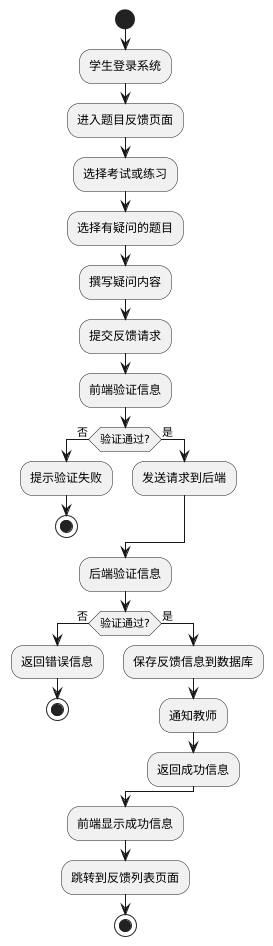

> 图20 题目反馈流程图 实现细节：
>
> 前端实现：
>
> 使用Vue.js 组件实现题目反馈界面 实现题目选择和疑问撰写功能
>
> 使用Axios 发送POST 请求到/api/feedback/add 处理后端响应，显示操作结果
>
> 后端实现： 控制器：FeedbackController.addFeedback()处理反馈请求
> 服务层：FeedbackService.addFeedback()实现业务逻辑
> 数据访问：FeedbackMapper 操作数据库 通知：使用WebSocket 或邮件通知教师
>
> 数据库操作：
>
> 保存反馈：INSERT INTO feedback (id, student_id, question_id, content,
> status, create_time) VALUES (?, ?, ?, ?, ?, ?)
>
> 2.6.2 讲评撰写 功能详细设计：
>
> 讲评撰写功能允许教师查看学生的反馈，针对学生的问题撰写详细的讲评和解答。

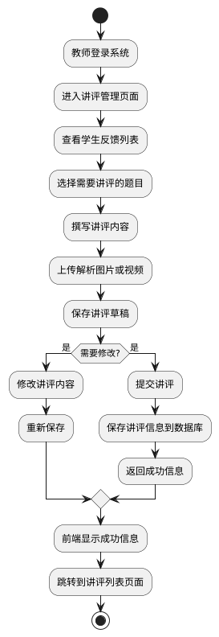

> 图21 讲评撰写流程图 实现细节：
>
> 前端实现：
>
> 使用Vue.js 组件实现讲评撰写界面 实现反馈查看和讲评撰写功能
>
> 实现图片或视频上传功能
>
> 使用Axios 发送POST 请求到/api/review/add 处理后端响应，显示操作结果
>
> 后端实现： 控制器：ReviewController.addReview()处理讲评撰写请求
> 服务层：ReviewService.addReview()实现业务逻辑 数据访问：ReviewMapper
> 操作数据库 文件处理：处理图片或视频上传，存储到本地文件系统
>
> 数据库操作：
>
> 保存讲评：INSERT INTO review (id, question_id, content, image_url,
> video_url, create_time, create_by) VALUES (?, ?, ?, ?, ?, ?, ?)
>
> 更新反馈状态：UPDATE feedback SET status = '已讲评' WHERE question_id
> = ?
>
> 2.6.3 讲评发布 功能详细设计：
>
> 讲评发布功能允许教师将撰写好的讲评发布到系统中，供学生查看和学习。

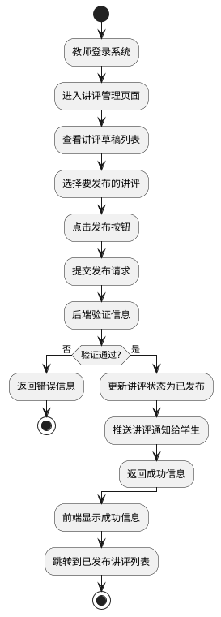

> 图22 讲评发布流程图

实现细节： 前端实现：

> 使用Vue.js 组件实现讲评发布界面 实现讲评草稿列表和发布功能
>
> 使用Axios 发送POST 请求到/api/review/publish/{id}
>
> 处理后端响应，显示操作结果
>
> 后端实现： 控制器：ReviewController.publishReview()处理发布请求
> 服务层：ReviewService.publishReview()实现业务逻辑
> 数据访问：ReviewMapper 操作数据库 通知：使用WebSocket
> 或邮件推送讲评通知
>
> 数据库操作：
>
> 更新状态：UPDATE review SET status = '已发布', publish_time = ? WHERE
> id = ? 生成通知：INSERT INTO notice (id, title, content, type,
> create_time, create_by) VALUES (?, ?, ?, ?, ?, ?)
>
> 2.6.4 讲评查看 功能详细设计：
>
> 讲评查看功能允许学生查看教师发布的讲评，了解题目的解题思路和方法。

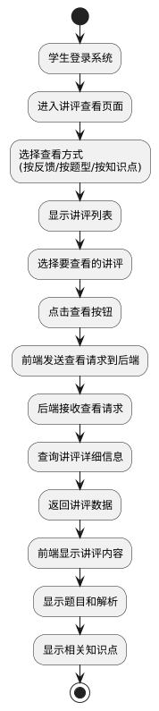

> 图23 讲评查看流程图

实现细节： 前端实现：

> 使用Vue.js 组件实现讲评查看界面 实现讲评列表和详情查看功能
>
> 使用Axios 发送GET 请求到/api/review/list 和/api/review/detail/{id}
> 处理后端响应，显示讲评内容
>
> 后端实现：
> 控制器：ReviewController.listReviews()和ReviewController.getReviewDetail()处理查
> 看请求
> 服务层：ReviewService.listReviews()和ReviewService.getReviewDetail()实现业务逻
> 辑
>
> 数据访问：ReviewMapper 操作数据库
>
> 数据库操作：
>
> 查询讲评：SELECT \* FROM review WHERE status = '已发布' ORDER BY
> publish_time DESC
>
> 讲评详情：SELECT \* FROM review WHERE id = ? 相关题目：SELECT \* FROM
> question WHERE id = ?
>
> 2.7 通知管理模块 2.7.1 通知创建 功能详细设计：
>
> 通知创建功能允许教师创建各类通知，包括考试通知、系统公告等。

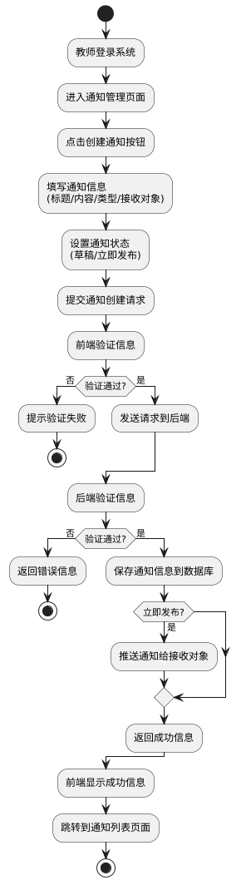

> 图24 通知创建流程图

实现细节： 前端实现：

> 使用Vue.js 组件实现通知创建界面 实现通知信息表单
>
> 使用Axios 发送POST 请求到/api/notice/add 处理后端响应，显示操作结果
>
> 后端实现： 控制器：NoticeController.addNotice()处理通知创建请求
> 服务层：NoticeService.addNotice()实现业务逻辑 数据访问：NoticeMapper
> 操作数据库 推送：使用WebSocket 或邮件推送通知
>
> 数据库操作：
>
> 保存通知：INSERT INTO notice (id, title, content, type, status,
> create_time, create_by) VALUES (?, ?, ?, ?, ?, ?, ?)
>
> 保存通知接收关系：INSERT INTO notice_user (notice_id, user_id) VALUES
> (?, ?)
>
> 2.7.2 通知发布 功能详细设计：
>
> 通知发布功能允许教师将创建好的通知发布到系统中，系统会自动推送给相关用
> 户。

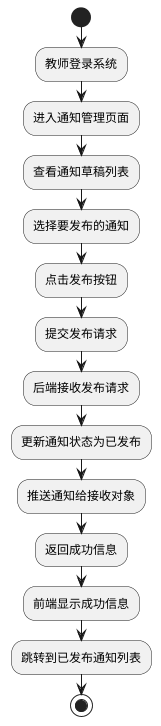

> 图25 通知发布流程图

实现细节： 前端实现：

> 使用Vue.js 组件实现通知发布界面 实现通知草稿列表和发布功能
>
> 使用Axios 发送POST 请求到/api/notice/publish/{id}
> 处理后端响应，显示操作结果
>
> 后端实现： 控制器：NoticeController.publishNotice()处理发布请求
> 服务层：NoticeService.publishNotice()实现业务逻辑
> 数据访问：NoticeMapper 操作数据库 推送：使用WebSocket 或邮件推送通知
>
> 数据库操作：
>
> 更新状态：UPDATE notice SET status = '已发布', publish_time = ? WHERE
> id = ? 查询接收对象：SELECT user_id FROM notice_user WHERE notice_id =
> ?
>
> 2.7.3 通知查看 功能详细设计：
>
> 通知查看功能允许用户查看系统发布的通知，支持按时间、类型等条件筛选。

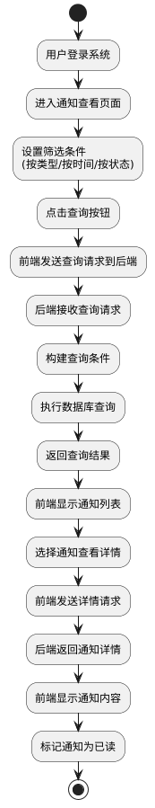

> 图26 通知查看流程图

实现细节： 前端实现：

> 使用Vue.js 组件实现通知查看界面 实现通知筛选和查看功能
>
> 使用Axios 发送GET 请求到/api/notice/list 和/api/notice/detail/{id}
> 处理后端响应，显示通知信息
>
> 后端实现：
> 控制器：NoticeController.listNotices()和NoticeController.getNoticeDetail()处理查看
> 请求
> 服务层：NoticeService.listNoticesByUser()和NoticeService.getNoticeDetail()实现业
> 务逻辑
>
> 数据访问：NoticeMapper 操作数据库
>
> 数据库操作：
>
> 查询通知：SELECT \* FROM notice n JOIN notice_user nu ON n.id =
> nu.notice_id WHERE nu.user_id = ? AND n.type = ? AND n.publish_time
> BETWEEN ? AND ? ORDER BY n.publish_time DESC
>
> 通知详情：SELECT \* FROM notice WHERE id = ?
>
> 标记已读：UPDATE notice_user SET status = '已读' WHERE notice_id = ?
> AND user_id = ?
>
> 2.7.4 通知确认 功能详细设计：
>
> 通知确认功能允许学生对查看到的通知进行确认操作，表示已阅读并了解通知内
> 容。

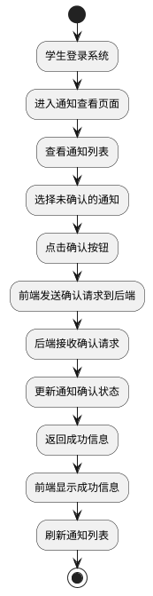

> 图27 通知确认流程图

实现细节： 前端实现：

> 使用Vue.js 组件实现通知确认界面 实现通知确认功能
>
> 使用Axios 发送POST 请求到/api/notice/confirm/{id}
> 处理后端响应，显示操作结果
>
> 后端实现：
>
> 控制器：NoticeController.confirmNotice()处理确认请求
> 服务层：NoticeService.confirmNotice()实现业务逻辑
> 数据访问：NoticeMapper 操作数据库
>
> 数据库操作：
>
> 更新状态：UPDATE notice_user SET status = '已确认' WHERE notice_id = ?
> AND user_id = ?
>
> 2.8 系统管理模块 2.8.1 系统配置 功能详细设计：
>
> 系统配置功能允许管理员配置系统的各项参数，包括考试时长、题型设置、难度
> 等级等。

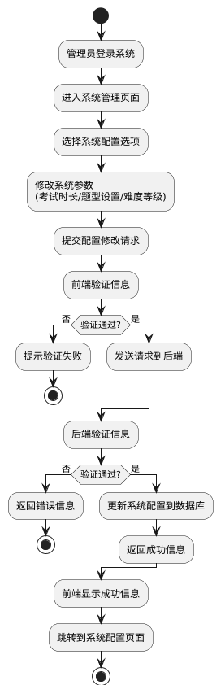

> 图28 系统配置流程图
>
> 实现细节：
>
> 前端实现：
>
> 使用Vue.js 组件实现系统配置界面 实现系统参数配置表单
>
> 使用Axios 发送POST 请求到/api/system/config 处理后端响应，显示操作结果
>
> 后端实现： 控制器：SystemController.updateConfig()处理配置请求
> 服务层：SystemService.updateConfig()实现业务逻辑
> 数据访问：ConfigMapper 操作数据库 权限控制：使用Spring Security
> 确保只有管理员可以操作
>
> 数据库操作：
>
> 更新配置：UPDATE config SET value = ? WHERE key = ?
>
> 2.8.2 日志管理 功能详细设计：
>
> 日志管理功能允许管理员查看系统的操作日志和运行日志，便于问题排查和审计。

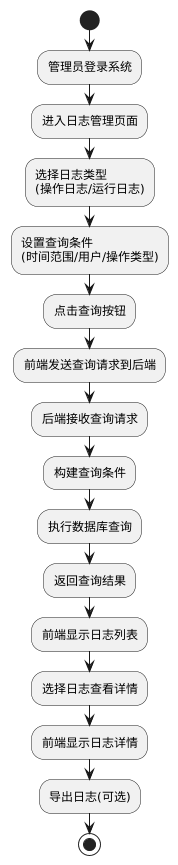

> 图29 日志管理流程图

实现细节： 前端实现：

> 使用Vue.js 组件实现日志管理界面 实现日志筛选和查看功能
>
> 使用Axios 发送GET 请求到/api/system/logs 处理后端响应，显示日志信息
>
> 后端实现： 控制器：SystemController.listLogs()处理日志查询请求
> 服务层：SystemService.listLogs()实现业务逻辑 数据访问：LogMapper
> 操作数据库 权限控制：使用Spring Security 确保只有管理员可以操作
>
> 数据库操作：
>
> 查询日志：SELECT \* FROM log WHERE type = ? AND create_time BETWEEN ?
> AND ? AND user_id = ? AND operation = ? ORDER BY create_time DESC
>
> 3 小结
>
> 详细设计文档是在概要设计的基础上，对系统进行更加具体、详细的设计，为后
> 续的编码实现提供直接的指导。
>
> 本详细设计文档主要完成了以下工作：
> 明确了详细设计的目的与原则：阐述了详细设计的目的是指导编码实现、确保系
> 统质量、便于测试和维护、促进团队协作、符合软件工程规范；遵循了准确性、
> 完整性、可操作性、模块化、可读性、可维护性、安全性、性能优化等原则。
> 完成了系统各模块的详细设计：
> 用户管理模块：包括用户登录、学生信息管理、权限管理等功能的详细设计
> 试题管理模块：包括试题录入、试题查询、试题修改、试题删除、试题分类管理
> 等功能的详细设计
> 试卷管理模块：包括自动组卷、手动组卷、试卷查询、试卷删除、试卷预览等功
> 能的详细设计
> 考试管理模块：包括考试组织、考试信息查看、在线考试、成绩管理等功能的详
> 细设计
> 错题管理模块：包括错题自动收集、错题练习、错题搜索、错题统计等功能的详
> 细设计
> 题目反馈与讲评模块：包括题目反馈、讲评撰写、讲评发布、讲评查看等功能的
> 详细设计
> 通知管理模块：包括通知创建、通知发布、通知查看、通知确认等功能的详细设
> 计
>
> 系统管理模块：包括系统配置、日志管理、数据备份等功能的详细设计
> 提供了详细的实现方案：
> 为每个功能模块提供了程序流程图，直观展示了功能的实现流程
> 详细阐述了每个功能的前端实现、后端实现和数据库操作
> 明确了各个功能模块的接口定义和数据结构 考虑了系统的安全性和性能：

在在线考试模块中采用了多种防作弊机制
在权限管理中使用了基于角色的访问控制

> 参考资料（列出撰写过程中参考的学术论文、技术文档和书籍）
>
> \[1\]戴毅. 基于SpringBoot+Vue的在线考试系统设计与实现\[J\].
> 数字技术与应 用, 2024, 42(04): 90-92.
>
> \[2\]韩瑞, 王利强. 基于Java的在线考试系统设计与实现\[J\].
> 工业控制计算机, 2024, 37(09): 146-147.
>
> \[3\]姜一波. 基于SpringBoot+Vue的在线考试系统设计与实现\[J\].
> 无线互联科 技, 2023, 20(23): 68-71.
>
> \[4\]唐媛媛, 王晓楠, 李京培, 等. 基于SpringBoot的病原生物学在线智能化
> 实验考试系统建设探索\[J\]. 赤峰学院学报(自然科学版), 2023, 39(12):
>
> 75-78.
>
> \[5\]王霏儿. 基于SpringBoot的在线考试系统设计与实现\[D\]. 南昌:
> 江西师范 大学, 2023.
>
> \[6\]吴晓云, 袁昊东. 基于Spring Boot的在线考试管理系统\[J\].
> 微型电脑应用, 2024, 40(11): 199-204.
>
> \[7\]Md. Monarul Islam, Saifuddin Khaled Nabil, Saydul Akbar Murad, et
> al. The Development and Deployment of an Online Exam System: A Web
> Application\[J\]. Asian Journal of Research in Computer Science, 2023,
> 16(2): 1-11.
>
> \[8\]吴敏希. 《行政能力测试》在线备考系统的分析和设计\[D\]. 南昌:
> 南昌大学, 2016.
>
> \[9\]张俊. 基于Java的公务员备考微信小程序\[J\]. 电脑知识与技术, 2022,
> 18(04): 112-114.
>
> \[10\]张海藩, 牟永敏. 软件工程导论\[M\]. 6版. 北京: 清华大学出版社,
> 2013.
